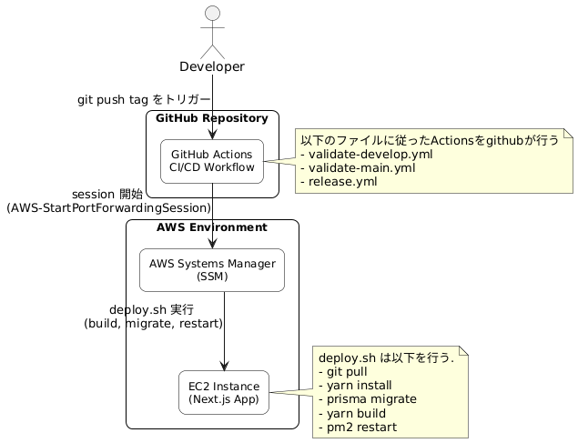
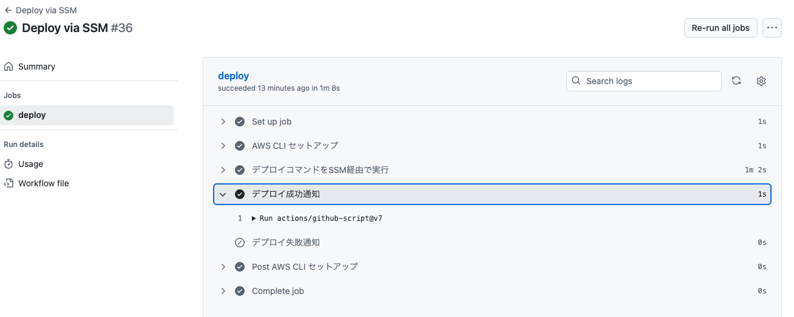
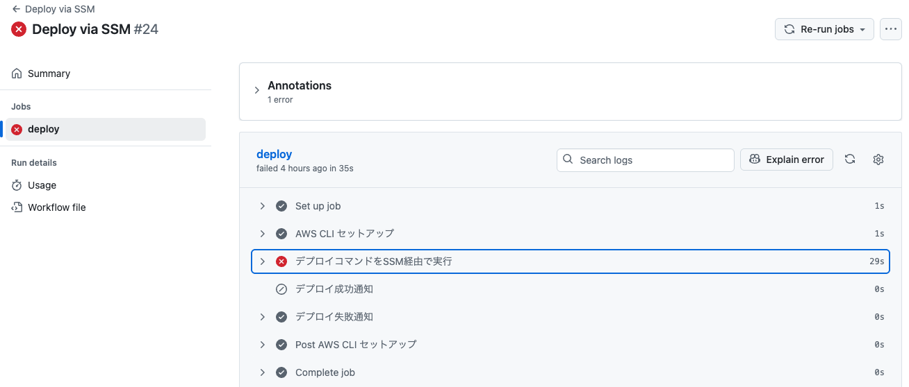
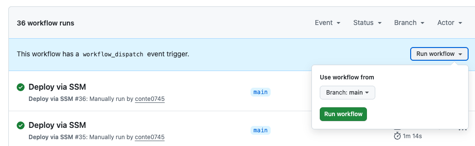
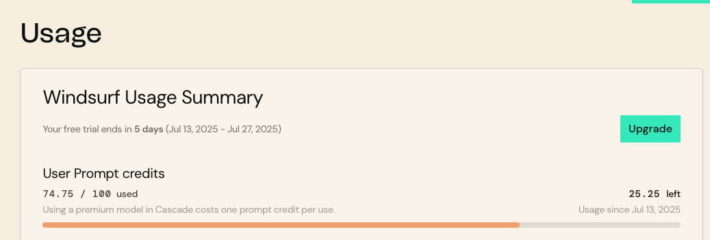
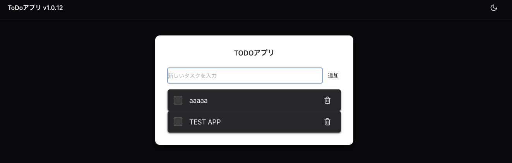

# Github Actions + AWS EC2 + AWS SSM を利用して next.js アプリの CI/CD を構築してみた

## はじめに

こんにちは。<br />
今回は AI と Github Actions を利用して、AWS EC2 への自動デプロイの設定を行いたいと思います。<br />
また、運用手順や設定手順をまとめて、最終的には、以下の形まで持っていくことを目的とします。<br />


### 最終ゴール 🎯
以下の CI/CD パイプラインを構築・運用します：

* develop ブランチへのマージ時：
  * Lint / 型チェック
  * コンパイルエラーがないことチェック
* main ブランチへのマージ時：
  * Lint / 型チェック
  * 単体テストの通過
  * 必要に応じてタグを付与してリリーストリガー
* タグプッシュ時（例：v1.0.0）：
  * GitHub Actions によってデプロイワークフローを自動実行
  * AWS SSM 経由で EC2 上のアプリをデプロイ
  * EC2 上で以下処理が自動実行：
    * Git Pull
    * yarn install
    * Prisma マイグレーション
    * Next.js ビルド
    * PM2 によるアプリ起動・再起動
* セキュリティの担保：
  * SSMを利用したデプロイ
  * GitHub Secrets による機密管理

### 概要図



## 目次

- [はじめに](#はじめに)
- [ブランチ保護](#ブランチ保護)
- [GitHub Actions ワークフロー構成](#github-actions-ワークフロー構成)
- [AWS SSM 経由デプロイ設定](#aws-ssm-経由デプロイ設定)
- [GitHub Secrets 設定手順](#github-secrets-設定手順)

## ブランチ保護

### ブランチ保護ルール（GitHub 側設定）
GitHub のブランチ保護機能を使って以下を設定します。

#### develop ブランチ
プルリクエストのみマージ可

ビルド（lint / 型チェック）に成功していること

❌ テスト結果は検証しなくてよい

#### main ブランチ
プルリクエストのみマージ可

ビルド + テストに成功していること

タグの作成は main ブランチのみ許可(今後はreleaseブランチのみ許可になるかも)

👉 設定場所: GitHub リポジトリの Settings > Branches > Branch protection rules

## GitHub Actions ワークフロー構成

### GitHub Actions ワークフロー構成

```bash
.github/workflows/
├── validate-develop.yml   # develop 向けのビルド検証
├── validate-main.yml      # main 向けのテスト検証
└── release.yml           # Git タグ作成時に EC2 へ SSM 経由デプロイ
```

#### 2-1. develop ブランチ検証ワークフロー

ファイル: `.github/workflows/validate-develop.yml`


#### 2-2. main ブランチ検証ワークフロー

ファイル: `.github/workflows/validate-main.yml`


#### 2-3. デプロイワークフロー（SSM 経由）

ファイル: `.github/workflows/release.yml`

## AWS SSM 経由デプロイ設定

### 必要な AWS 設定

#### 1. EC2 インスタンス設定

- SSM Agent: EC2 インスタンスに SSM Agent がインストール済みであること
- IAM Role: EC2 インスタンスに SSM 用の IAM ロールをアタッチ
  - `AmazonSSMManagedInstanceCore` ポリシーを含む

#### 2. GitHub Secrets 設定

| キー名                      | 内容                           |
| ------------------------ | ---------------------------- |
| `AWS_ACCESS_KEY_ID`      | AWS アクセスキー ID                |
| `AWS_SECRET_ACCESS_KEY`  | AWS シークレットアクセスキー             |
| `AWS_REGION`             | AWS リージョン（例: ap-northeast-1） |
| `INSTANCE_ID`            | デプロイ先 EC2 インスタンス ID（例: i-xxx） |

### デプロイスクリプト詳細

ファイル: `deploy/deploy.sh`

#### デプロイフロー概要

1.  開発者がタグを作成
    ```bash
    git tag -a v1.0.0 -m "Release v1.0.0"
    git push origin v1.0.0
    ```

2.  GitHub Actions が自動実行
    * タグプッシュを検知
    * AWS 認証情報を設定
    * SSM 経由で EC2 にコマンド送信
    * デプロイ結果をコミットにコメント

ワークフロー成功時


ワークフロー失敗時


1.  EC2 でデプロイスクリプト実行
    * 最新コードを取得
    * 依存関係をインストール
    * DB マイグレーション実行
    * アプリケーションビルド
    * PM2 でサービス再起動

※ `run workflow` ボタンを押下することで手動でデプロイを実行できます。



#### デプロイスクリプト概要

1. 📝 ログ出力とディレクトリ移動
   * デプロイ開始のログ出力
   * アプリケーションのルートディレクトリ（例: /opt/next-app）に移動

2. 🔍 環境確認
    * 現在のユーザー情報表示（whoami）
    * カレントディレクトリ確認
    * ディレクトリの所有者・グループ確認

3. ⚙️ Yarn / Temp ディレクトリ準備
    * Yarn キャッシュディレクトリの作成（例: /var/cache/yarn）
    * 一時作業ディレクトリ（例: /var/tmp）の確認と作成

4. 📂 Git 状態確認
    * .git ディレクトリの存在確認
    * Git リポジトリとして有効かどうかを検証・ログ出力

5. 📥 最新コード取得（main ブランチ）
    * git pull origin main によって最新のコードを取得

6. 📦 yarn install 実行（immutable）
    * yarn install --immutable を使用し、ロックファイルに従って依存関係を厳密にインストール
    * キャッシュディレクトリを明示的に指定

7. 🧩 Prisma マイグレーション
    * npx prisma migrate deploy を実行
    * DB スキーマを最新の状態に適用

8. 🔨 Next.js ビルド
    * yarn build を実行し、アプリケーションの静的ビルドを生成

9. 🔄 PM2 プロセス確認と起動/再起動
    * pm2 describe next-app でプロセスの存在を確認
    * 存在する場合 → pm2 restart next-app
    * 存在しない場合 → pm2 start yarn --name next-app -- start

10. ログ出力と完了処理
    * デプロイ完了メッセージを出力
    * タイムスタンプ付きのログを記録


### セキュリティ考慮事項

- SSM 使用: SSH キーの管理が不要
- IAM ロール: 最小権限の原則に従った権限設定
- Secrets 管理: GitHub Secrets で機密情報を安全に管理
- 実行ユーザー: `ssm-user` ユーザでスクリプト実行

## GitHub Secrets 設定手順

### AWS 認証情報の設定

1. GitHub リポジトリ → Settings → Secrets and variables → Actions
2. New repository secret をクリック
3. 以下の Secrets を追加:

```
AWS_ACCESS_KEY_ID: AKIA...
AWS_SECRET_ACCESS_KEY: xxx...
AWS_REGION: ap-northeast-1
INSTANCE_ID: i-0123456789abcdef0
```

## コラム

### クライアントツールからのDBポートフォワード方法

1. AWS CLI v2 をインストールする
2. AWS CLI 用の [Session Manager](https://docs.aws.amazon.com/ja_jp/systems-manager/latest/userguide/session-manager-working-with-install-plugin.html) プラグインをインストールする
3. instance-id を以下のコマンドから置換して実行する

```bash
aws ssm start-session \
  --target {INSTANCE_ID} \
  --document-name AWS-StartPortForwardingSession \
  --parameters '{"portNumber":["3306"],"localPortNumber":["13306"]}'
```

### 利用したEC2について

EC2を起動時のユーザデータは`ec2-user-data.sh`に記載してあります。
また、主なスペックは以下です。

- インスタンスタイプ: t3.small
- ディスク容量： 20GB

### MySql の初回設定

MySQLのrootパスワードを設定して next_db や appuser を作成して下さい。<br />
パスワードは任意の設定をして下さい。また、DB_ROOT_PASSWORD＝初期パスワードはログから探して下さい。

```bash
# 初期パスワードを取得
sudo grep 'temporary password' /var/log/mysqld.log

# 初期パスワードを用いてrootパスワードを変更
sudo mysql -u root -p$DB_ROOT_PASSWORD -e "ALTER USER 'root'@'localhost' IDENTIFIED BY '8IG6nGdCg6!$';"

# 更新したrootパスワードを用いてDB作成
sudo mysql -u root -p8IG6nGdCg6!$ -e "CREATE DATABASE next_db;"
sudo mysql -u root -p8IG6nGdCg6!$ -e "CREATE USER 'appuser'@'localhost' IDENTIFIED BY '8IG6nGdCg6!$';"
sudo mysql -u root -p8IG6nGdCg6!$ -e "GRANT ALL PRIVILEGES ON next_db.* TO 'appuser'@'localhost';"
sudo mysql -u root -p8IG6nGdCg6!$ -e "FLUSH PRIVILEGES;"
```

### 利用したAIについて

今回は ChatGPT と Windsurf（Claude Sonnet 4）を利用しました。
Windsurf には 2 週間（100クレジット分）の無料トライアルが残っていたため、主にコードの修正や改善に活用しました。
途中で面倒になり、エラーコードをそのまま丸投げしてしまい、多少クレジットを無駄にしてしまった感はありますが、それでも雑に投げた内容からしっかりと解決策を導き出してくれたので、結果的には満足しています。

結果使ったのは、75クレジットでした。（大体400円くらい?。）




ちなみに、作成したアプリはTODOアプリです。sonarlintやeslint、prettier、vitestを導入して、コード品質を保ちながら開発を行いました。MySQLと連携したCRUDができます。



## 終わりに

以上で、CI/CDの設定が完了しました。

初めてトライした際は、EC2 のスペックをケチったことが原因で、メモリ容量やディスク容量が不足し、デプロイに失敗してしまいました。また、権限まわりにも課題がありました。たとえば、git pull を実行するユーザーやシェルスクリプトを実行するユーザーが、SSH ログイン時と SSM ログイン時で異なることがあり、その点でも苦労しました。同一の処理を行うために、共通のグループを作成するなどして対応しました。CI/CD の勉強をするつもりが、結果的に権限まわりの学習にもなりました。


